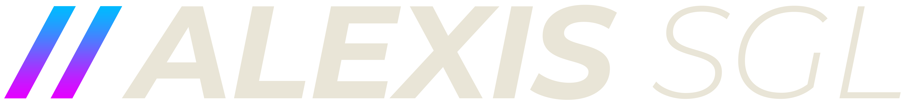

  <h1>Salut, je suis Alexis SIEGEL 👋</h1>

  
<b>Étudiant Ingénieur en Informatique</b> — <em>Infrastructure & Cybersécurité</em>

  

    
    
    
  

---

## 👨‍💻 À propos de moi

> *"Passionné par la construction d'environnements informatiques fiables, évolutifs et sécurisés."*

Actuellement étudiant ingénieur à **CESI École d'Ingénieurs** (Strasbourg), ce GitHub me sert de portfolio pour exposer les différents projets sur lesquels j'ai eu l'opportunité de travailler, principalement dans le cadre de ma formation.

Mon objectif professionnel est de me spécialiser dans l'**architecture et l'administration des réseaux**. Cependant, ma formation m'a permis d'acquérir une forte polyvalence, du développement logiciel bas niveau à la création d'applications web complètes.

- 🎯 **Mon ambition :** Construire, sécuriser et optimiser des infrastructures réseaux.
- 🎓 **Ce que vous trouverez ici :** Mes projets scolaires, des simulations réseaux (Cisco), des applications web (Front/Back), ainsi que de la programmation orientée objet et des systèmes embarqués.
- 📫 **Me contacter :** N'hésitez pas à m'écrire à **contact@alexis-sgl.fr**, ou à passer par mes liens professionnels ci-dessus.

---

## 🛠️ Ma Stack Technique

### 🔧 Systèmes & Réseaux

  
  
  
  
  

### 🌐 Développement Web

  
  
  
  
  
  

### 💻 Programmation

  
  
  
  

### 🧰 Outils

  
  
  
  
  

---

## 🏆 Certifications

  

---

  
<em>"Plus que la technique pure, c'est l'envie de relever des défis concrets qui m'anime."</em>

   
  
🚀 <strong>À la recherche d'une alternance</strong> — Ingénieur Infrastructure & Cybersécurité — Contrat de 3 ans à partir d'octobre 2026

  
📍 Secteur <strong>Strasbourg & Haguenau</strong> (Bas-Rhin)

---

<picture>
  <source media="(prefers-color-scheme: dark)" srcset="https://raw.githubusercontent.com/Alexis-SGL/Alexis-SGL/output/github-contribution-grid-snake-dark.svg?palette=github-dark&color_snake=a855f7&color_dots=#161b22,#30363d,#8957e5,#a371f7,#d2a8ff" />
  <source media="(prefers-color-scheme: light)" srcset="https://raw.githubusercontent.com/Alexis-SGL/Alexis-SGL/output/github-contribution-grid-snake.svg" />
  
</picture>
